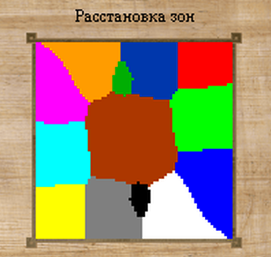

#"Double Trouble"

## Шаблон "Double Trouble" генерирует карту размером 72х72 для командной игры формата 2х2. 

## Заголовок 2

### Заголовок 3

#### Заголовок 4

**Карта разделена на 13 зон:**
- 4 респа по два друг напротив друга
- 2 зоны рынка между респами союзников
- 4 угловых смежных зоны
- 2 средние боковые зоны
- 1 центральная зона

На респе каждого игрока располагается горот t1, двое руин, лавка торговца 16 отрядов и 4 сундука. Помимо расходных банок городе возможно получить один предмет из трёх: артефакт, знамя, реликвию. Так же выпадает случайные талисман или сфера. В обоих руинах так же случайное выпадение одного предмета: артефакт, знамя, реликвия. Концепция шаблоне предполагает лавку в зоне респа без предметов категории: **артефакт, знамя, реликвия**. В лавке торговца в зоне респа можно обнаружить: расходные банки, свитки (в том числе один свиток на урон), сферы, талисманы (в том числе и один талисман вызова), посохи, а так же две перманентные банки и одна аура.
Каждый респ располагает двумя рудниками золота, двумя рудниками собственной маны и одним рудником маны союзника.

Между респами союзников создано множество свободных проходов без ГО. Так же между респами союзников располагается маленькая зона с рынком для удобного обмена маной друг с другом. В рынке нет золота и по 400 каждой маны. Курс обмена золота на ману 1 к 75. Курс обмена ману на ману 25 к 25.

**Полужирный текст**

*Курсивный текст*

***Полужирный и курсивный текст***

Неупорядоченный список:
- Элемент 1
- Элемент 2
  - Подэлемент 2.1
  - Подэлемент 2.2
- Элемент 3

Упорядоченный список:
1. Первый элемент
2. Второй элемент
   1. Подэлемент 2.1
   2. Подэлемент 2.2
3. Третий элемент
